# How LLM Applications Work: Complete Architecture Guide

A comprehensive guide to understanding LLM application architecture, covering both traditional LangChain and modern MCP approaches with detailed diagrams and real-world examples.

---

## Table of Contents

1. [Overview: LLM Application Architecture](#overview-llm-application-architecture)
2. [Understanding LLM Applications: The Basics](#understanding-llm-applications-the-basics)
3. [Traditional Approach: LangChain Architecture](#traditional-approach-langchain-architecture)
4. [Modern Approach: MCP (Model Context Protocol)](#modern-approach-mcp-model-context-protocol)
5. [Complete Message Flow: User Input to Response](#complete-message-flow-user-input-to-response)
6. [Comparison: LangChain vs MCP](#comparison-langchain-vs-mcp)
7. [Real-World Implementation Examples](#real-world-implementation-examples)
8. [When to Use Each Approach](#when-to-use-each-approach)

---

## Overview: LLM Application Architecture

### What is an LLM Application?

An LLM (Large Language Model) application is a system that uses AI models like GPT-4, Claude, or Gemini to provide intelligent responses by:
1. Understanding user queries
2. Retrieving relevant context (RAG - Retrieval Augmented Generation)
3. Calling external tools (APIs, databases, etc.)
4. Generating contextually aware responses

---

### Understanding LLM Applications Flow

**User asks:** "What's our refund policy?"

Here's the complete flow step-by-step:

```
┌─────────────────────────────────────────────────────────────────┐
│                    BASIC RAG FLOW                                │
└─────────────────────────────────────────────────────────────────┘

User Input: "What's our refund policy?"
    │
    ↓
┌───────────────────┐
│  1. API Gateway   │  Check auth, rate limits
└────────┬──────────┘
         ↓
┌───────────────────┐
│  2. FastAPI       │  Receive request
└────────┬──────────┘
         ↓
┌───────────────────────────────────────────────────────────────┐
│  3. RAG Pipeline                                              │
│     (Provide additional info to model that's not in          │
│      training data - like your company's refund policy)      │
│                                                               │
│  Step A: Convert question to embedding (vector)              │
│    Input: "What's our refund policy?"                        │
│    ↓ Call OpenAI Embeddings API                              │
│    Output: [0.023, -0.145, 0.678, ..., 0.234]                │
│            (1536 numbers representing the question)           │
│                                                               │
│  Step B: Search Vector Database                              │
│    Query: [0.023, -0.145, ...]                               │
│    ↓ Search Pinecone for similar document vectors            │
│    Output: Top 3 matching documents                          │
│      - "Refund policy: 30 days..." (similarity: 0.95)        │
│      - "Return process: Contact..." (similarity: 0.87)       │
│      - "Warranty info..." (similarity: 0.75)                 │
│                                                               │
│  Step C: Build prompt with retrieved context                 │
│    System: "You are a helpful assistant"                     │
│    Context: [Retrieved documents text]                       │
│    Question: "What's our refund policy?"                     │
│                                                               │
└────────┬──────────────────────────────────────────────────────┘
         ↓
┌───────────────────┐
│  4. Call LLM      │  Send prompt to OpenAI GPT-4
│  (GPT-4)          │  LLM generates answer using context
└────────┬──────────┘
         ↓
┌───────────────────┐
│  5. Return        │  "Our refund policy allows returns
│  Response         │   within 30 days of purchase..."
└───────────────────┘
```

### Simple Python Example

```python
from fastapi import FastAPI
import openai
import pinecone

app = FastAPI()

# Initialize services
openai.api_key = "your-openai-key"
pinecone.init(api_key="your-pinecone-key", environment="us-west1-gcp")
index = pinecone.Index("company-docs")

@app.post("/chat")
async def chat(question: str):
    """
    Basic RAG implementation - all steps manual
    
    RAG (Retrieval Augmented Generation) helps the LLM answer questions
    about YOUR data (company policies, products, etc.) that weren't 
    part of its training data.
    """
    
    # ═══════════════════════════════════════════════════════════
    # STEP 1: Convert question to embedding (vector)
    # ═══════════════════════════════════════════════════════════
    embedding_response = openai.Embedding.create(
        model="text-embedding-ada-002",
        input=question
    )
    question_embedding = embedding_response['data'][0]['embedding']
    # Result: [0.023, -0.145, 0.678, ..., 0.234] (1536 numbers)
    
    # ═══════════════════════════════════════════════════════════
    # STEP 2: Search your vector database for similar documents
    # ═══════════════════════════════════════════════════════════
    search_results = index.query(
        vector=question_embedding,
        top_k=3,  # Get top 3 most similar documents
        include_metadata=True
    )
    
    # Extract document text from search results
    retrieved_docs = []
    for match in search_results['matches']:
        doc_text = match['metadata']['text']
        retrieved_docs.append(doc_text)
    
    # ═══════════════════════════════════════════════════════════
    # STEP 3: Build prompt with context
    # ═══════════════════════════════════════════════════════════
    context = "\n\n".join(retrieved_docs)
    prompt = f"""
You are a helpful assistant. Answer the question based ONLY on the context below.

Context:
{context}

Question: {question}

Answer:
"""
    
    # ═══════════════════════════════════════════════════════════
    # STEP 4: Call LLM with the prompt
    # ═══════════════════════════════════════════════════════════
    llm_response = openai.ChatCompletion.create(
        model="gpt-4",
        messages=[
            {"role": "system", "content": "You are a helpful assistant."},
            {"role": "user", "content": prompt}
        ],
        temperature=0.7
    )
    
    # ═══════════════════════════════════════════════════════════
    # STEP 5: Extract and return the answer
    # ═══════════════════════════════════════════════════════════
    answer = llm_response.choices[0].message.content
    
    return {
        "answer": answer,
        "sources": [match['id'] for match in search_results['matches']]
    }

# To run: uvicorn main:app --reload
```

**What this code does:**
1. Takes a user question about YOUR company data (e.g., "What's our refund policy?")
2. Converts it to a vector (1536 numbers) using OpenAI embeddings
3. Searches Pinecone vector database for similar documents from YOUR company
4. Takes the top 3 matching documents (this is the "Retrieval" part of RAG)
5. Builds a prompt with those documents as context (this is the "Augmented" part)
6. Sends prompt to GPT-4 (this is the "Generation" part)
7. Returns GPT-4's answer **based on your company data, not just what it was trained on**

**Why RAG is important:** GPT-4 was trained on public internet data up to a certain date. It doesn't know YOUR company's refund policy, product details, or internal processes. RAG provides this information so the LLM can answer accurately.

---

### High-Level Architecture

Now that you've seen the basic approach, let's see how **frameworks** (LangChain) and **protocols** (MCP) does the same and more complext thing with less boilerplate codes.

**What these tools do:**
- **LangChain:** Provides pre-built components (chains, agents) that handle the RAG pipeline automatically
- **MCP:** Provides standardized servers for tools, so you don't write integration code

The diagram below shows the complete architecture using these frameworks:


### Key Components Explained

| Component | Purpose | Examples |
|-----------|---------|----------|
| **User Interface** | How users interact with the system | Web app, Mobile app, Slack bot, API |
| **API Gateway** | Security, rate limiting, routing | Kong, AWS API Gateway, NGINX |
| **Backend Server** | Main application logic | FastAPI, Flask, Express |
| **LLM Orchestrator** | Coordinates LLM calls and tools | LangChain, MCP Client, Custom |
| **LLM Services** | AI models for generation/understanding | GPT-4, Claude, Gemini, Llama |
| **Vector Database** | Semantic search for documents | Pinecone, Weaviate, Chroma, Milvus |
| **Cache** | Speed up repeated queries | Redis, Memcached |
| **External Tools** | Additional capabilities | Email, Calendar, APIs, Databases |
| **Monitoring** | Track performance and issues | Prometheus, Grafana, ELK |

---

## LangChain Approach:

### What is LangChain?

LangChain is a framework for building LLM applications with:
- **Chains**: Sequential operations (retrieve → process → generate)
- **Agents**: Autonomous decision-making about which tools to use
- **Memory**: Conversation history and context
- **Tools**: Custom Python functions for specific tasks

### LangChain Architecture Diagram


### LangChain Message Flow


### LangChain Code Example

```python
from langchain.agents import initialize_agent, Tool
from langchain.llms import OpenAI
from langchain.vectorstores import Pinecone
from langchain.embeddings import OpenAIEmbeddings
import sendgrid

# Initialize LLM
llm = OpenAI(temperature=0)

# Initialize vector store
embeddings = OpenAIEmbeddings()
vectorstore = Pinecone.from_existing_index("company-docs", embeddings)

# Define custom tools
def search_documents(query: str) -> str:
    """Search company documents using vector similarity"""
    docs = vectorstore.similarity_search(query, k=3)
    return "\n\n".join([doc.page_content for doc in docs])

def send_email(recipient: str, content: str) -> str:
    """Send email to user"""
    sg = sendgrid.SendGridAPIClient(api_key=os.environ.get('SENDGRID_API_KEY'))
    # ... send email logic ...
    return "Email sent successfully"

# Create LangChain tools
tools = [
    Tool(
        name="SearchDocs",
        func=search_documents,
        description="Search company documentation. Use this when you need information about policies, procedures, or products."
    ),
    Tool(
        name="SendEmail",
        func=send_email,
        description="Send an email to the user. Use this when user asks to email them information."
    )
]

# Initialize agent
agent = initialize_agent(
    tools=tools,
    llm=llm,
    agent="zero-shot-react-description",
    verbose=True
)

# Use in FastAPI endpoint
@app.post("/chat")
async def chat(request: ChatRequest):
    response = agent.run(request.message)
    return {"response": response}
```

### Pros and Cons of LangChain

**Pros:**
- ✅ **Easy to get started** - Lots of tutorials and examples
- ✅ **Python-native** - Everything in one language
- ✅ **Rich ecosystem** - Many pre-built chains and tools
- ✅ **Active community** - Large community, good support
- ✅ **Flexible** - Can customize everything

**Cons:**
- ❌ **Tightly coupled** - Tools only work within LangChain
- ❌ **Not reusable** - Can't share tools with other teams/apps
- ❌ **Custom code for each tool** - Write integration code yourself
- ❌ **Python-only** - Hard to integrate with other languages
- ❌ **No standardization** - Each team builds differently

---

## Modern Approach: MCP (Model Context Protocol)

### What is MCP?

**MCP (Model Context Protocol)** is a standardized protocol developed by Anthropic for connecting LLMs to external data sources and tools.

**Think of it as:**
- **USB for AI** - Universal connector for tools
- **REST API for LLMs** - Standardized way to expose tools
- **Plugin System** - Install and use pre-built integrations

### Key Concepts

1. **MCP Client**: Your LLM application that uses tools
2. **MCP Server**: Standalone process that provides tools
3. **MCP Protocol**: JSON-RPC standard for communication
4. **Resources**: Data that servers expose (files, docs, etc.)
5. **Tools**: Functions that servers provide
6. **Prompts**: Pre-configured prompt templates

### MCP Architecture Diagram

```mermaid
flowchart TB
    subgraph Client["Client Application"]
        UserInput[User Input]
    end
    
    subgraph App["FastAPI Application<br/>(MCP Client)"]
        Handler[Request Handler]
        MCPClient[MCP Client<br/>Protocol Handler]
        LLM[LLM Integration<br/>OpenAI/Claude]
    end
    
    subgraph Protocol["MCP Protocol<br/>(JSON-RPC over stdio/HTTP)"]
        Transport[Standardized Communication]
    end
    
    subgraph Servers["MCP Servers<br/>(Independent Processes)"]
        subgraph VectorServer["Vector DB Server"]
            VectorTools["Tools:<br/>• search()<br/>• upsert()<br/>• delete()"]
            VectorConn[Connection to Pinecone]
        end
        
        subgraph DBServer["Database Server"]
            DBTools["Tools:<br/>• query()<br/>• insert()<br/>• update()"]
            DBConn[Connection to PostgreSQL]
        end
        
        subgraph FileServer["Filesystem Server"]
            FileTools["Tools:<br/>• read_file()<br/>• list_dir()<br/>• search()"]
            FileConn[Access to Local Files]
        end
        
        subgraph EmailServer["Email Server"]
            EmailTools["Tools:<br/>• send_email()<br/>• read_inbox()"]
            EmailConn[Connection to SendGrid]
        end
        
        subgraph WebServer["Web Search Server"]
            WebTools["Tools:<br/>• search_web()<br/>• get_content()"]
            WebConn[Connection to Google API]
        end
    end
    
    UserInput --> Handler
    Handler --> MCPClient
    MCPClient --> LLM
    
    MCPClient <--> Transport
    
    Transport <--> VectorServer
    Transport <--> DBServer
    Transport <--> FileServer
    Transport <--> EmailServer
    Transport <--> WebServer
    
    VectorTools --> VectorConn
    DBTools --> DBConn
    FileTools --> FileConn
    EmailTools --> EmailConn
    WebTools --> WebConn
    
    style Client fill:#e1f5ff
    style App fill:#fff4e1
    style Protocol fill:#ffe1e1
    style Servers fill:#e8f5e9
```



### MCP Message Flow


### MCP Code Example

**1. MCP Server Configuration (JSON)**

```json
{
  "mcpServers": {
    "vector-db": {
      "command": "npx",
      "args": ["-y", "@modelcontextprotocol/server-vectordb"],
      "env": {
        "PINECONE_API_KEY": "${PINECONE_API_KEY}",
        "PINECONE_INDEX": "company-docs"
      }
    },
    "database": {
      "command": "npx",
      "args": ["-y", "@modelcontextprotocol/server-postgres"],
      "env": {
        "DATABASE_URL": "${DATABASE_URL}"
      }
    },
    "email": {
      "command": "python",
      "args": ["mcp-servers/email_server.py"],
      "env": {
        "SENDGRID_API_KEY": "${SENDGRID_API_KEY}"
      }
    }
  }
}
```

**2. Python MCP Client Code**

> **⚠️ IMPORTANT NOTE:** The code below shows **LOW-LEVEL** MCP implementation to demonstrate how the protocol works internally. This is similar to showing how LangChain's `agent.run()` works under the hood.
>
> **With high-level agent libraries** (which you can write yourself or use when available), the MCP code becomes just as simple as LangChain:
> 
> ```python
> # High-level MCP (same simplicity as LangChain!)
> from mcp import Agent  # High-level wrapper (write yourself or coming soon)
> 
> agent = Agent(mcp_client=mcp_client, llm=openai_client)
> response = agent.run(request.message)  # ← Just as simple!
> ```
>
> **The KEY BENEFIT of MCP:** Not simpler code, but **reusable tools**. You write (or install) an MCP server ONCE, and all your applications, teams, and even different programming languages can use it. With LangChain, you rewrite tool integration code for each application.

**Low-Level Implementation (For Learning How It Works):**

```python
from fastapi import FastAPI
from mcp import Client
import openai

app = FastAPI()

# Initialize MCP client
mcp_client = Client()

# Connect to MCP servers (auto-discovered from config)
mcp_client.connect_to_servers()

# Discover all available tools
tools = mcp_client.list_tools()
# Returns: [
#   {"server": "vector-db", "name": "search", "description": "...", "parameters": {...}},
#   {"server": "email", "name": "send_email", "description": "...", "parameters": {...}}
# ]

@app.post("/chat")
async def chat(request: ChatRequest):
    # Call OpenAI with MCP tools
    response = openai.chat.completions.create(
        model="gpt-4",
        messages=[
            {"role": "system", "content": "You are a helpful assistant."},
            {"role": "user", "content": request.message}
        ],
        tools=[
            {
                "type": "function",
                "function": {
                    "name": tool["name"],
                    "description": tool["description"],
                    "parameters": tool["parameters"]
                }
            }
            for tool in tools
        ]
    )
    
    # Handle tool calls (this loop is what high-level libraries do for you)
    if response.choices[0].message.tool_calls:
        tool_results = []
        
        for tool_call in response.choices[0].message.tool_calls:
            # Find which MCP server provides this tool
            server_name = next(
                t["server"] for t in tools 
                if t["name"] == tool_call.function.name
            )
            
            # Call MCP server via protocol
            result = mcp_client.call_tool(
                server=server_name,
                tool=tool_call.function.name,
                arguments=json.loads(tool_call.function.arguments)
            )
            
            tool_results.append({
                "tool_call_id": tool_call.id,
                "result": result
            })
        
        # Send tool results back to LLM
        final_response = openai.chat.completions.create(
            model="gpt-4",
            messages=[
                {"role": "system", "content": "You are a helpful assistant."},
                {"role": "user", "content": request.message},
                response.choices[0].message,
                *[
                    {
                        "role": "tool",
                        "tool_call_id": tr["tool_call_id"],
                        "content": json.dumps(tr["result"])
                    }
                    for tr in tool_results
                ]
            ]
        )
        
        return {"response": final_response.choices[0].message.content}
    
    return {"response": response.choices[0].message.content}
```

**Note:** This manual tool-calling loop is what LangChain's `agent.run()` does behind the scenes. High-level MCP agent libraries will abstract this away similarly.

**3. Custom MCP Server (Python)**

```python
# mcp-servers/email_server.py
from mcp.server import Server, Tool
import sendgrid
import os

# Create MCP server
server = Server("email-server")

# Define tool
@server.tool(
    name="send_email",
    description="Send an email to a recipient",
    parameters={
        "type": "object",
        "properties": {
            "to": {"type": "string", "description": "Recipient email"},
            "subject": {"type": "string", "description": "Email subject"},
            "body": {"type": "string", "description": "Email body"}
        },
        "required": ["to", "subject", "body"]
    }
)
async def send_email(to: str, subject: str, body: str):
    """Send email using SendGrid"""
    sg = sendgrid.SendGridAPIClient(api_key=os.environ['SENDGRID_API_KEY'])
    message = Mail(
        from_email='noreply@company.com',
        to_emails=to,
        subject=subject,
        html_content=body
    )
    response = sg.send(message)
    return {
        "status": "sent",
        "message_id": response.headers.get('X-Message-Id')
    }

# Run server
if __name__ == "__main__":
    server.run()
```

### Pros and Cons of MCP

**Pros:**
- ✅ **Standardized protocol** - Works with any MCP-compatible client/server
- ✅ **Reusable** - Write once, use in multiple applications (KEY ADVANTAGE!)
- ✅ **Language agnostic** - Servers can be in Python, Node.js, Go, etc.
- ✅ **Discoverable** - Tools self-describe their capabilities
- ✅ **Secure** - Servers run in isolated processes
- ✅ **Sharable** - Install community MCP servers like npm packages
- ✅ **Maintainable** - Update server without touching client code
- ✅ **No tool implementation code** - Use pre-built servers (0 lines of integration code)

**Cons:**
- ❌ **Newer technology** - Less mature than LangChain (2024 release)
- ❌ **High-level libraries emerging** - Currently need low-level code or write your own wrapper
- ❌ **More setup** - Need to run separate server processes
- ❌ **Smaller community** - Fewer resources and examples (growing fast)
- ❌ **Learning curve** - Need to understand protocol and architecture

**Current State (Nov 2024):**
- ✅ Protocol specification: Complete
- ✅ MCP servers: Growing ecosystem
- 🚧 High-level Python libraries: Emerging (write yourself or wait)
- 🚧 LangChain MCP integration: In development

**With high-level libraries** (available soon or write yourself ~100 lines), MCP code becomes just as simple as LangChain while keeping the reusability benefit.

---

## Complete Message Flow: User Input to Response

### Detailed Step-by-Step Flow (RAG + Tools)

Let's trace a complete request: **"What's our refund policy and email it to me?"**

```mermaid
flowchart TD
    Start([User: 'What is our refund<br/>policy and email it to me?'])
    
    Start --> Step1[Step 1: API Gateway<br/>• Check rate limit<br/>• Verify JWT token<br/>• Route to backend]
    
    Step1 --> Step2[Step 2: FastAPI Handler<br/>• Parse request<br/>• Log metrics<br/>• Start timer]
    
    Step2 --> Step3{Step 3: Check Cache<br/>Redis}
    
    Step3 -->|Cache Hit| Return1[Return cached response]
    Step3 -->|Cache Miss| Step4[Step 4: Generate Embedding<br/>OpenAI API<br/>text-embedding-ada-002]
    
    Step4 --> Step5[Step 5: Vector Search<br/>Query Pinecone<br/>Top 3 similar docs]
    
    Step5 --> Step6[Step 6: Construct Prompt<br/>System + Context + Question]
    
    Step6 --> Step7[Step 7: Call LLM<br/>OpenAI GPT-4<br/>with tool definitions]
    
    Step7 --> Step8{Step 8: LLM Decision}
    
    Step8 -->|No Tools| Step9[Generate answer directly]
    Step8 -->|Use Tools| Step10[Tool Call 1:<br/>Already have docs<br/>Generate answer]
    
    Step10 --> Step11[Tool Call 2:<br/>send_email]
    
    Step11 --> Step12[Call Email Service<br/>SendGrid/SMTP]
    
    Step12 --> Step13[Step 9: Send results<br/>back to LLM]
    
    Step13 --> Step14[Step 10: Final Response<br/>Format + Log + Cache]
    
    Step9 --> Step14
    Return1 --> End
    Step14 --> End([Return to User:<br/>'Our refund policy is...<br/>Email sent ✓'])
    
    style Start fill:#e1f5ff
    style Step3 fill:#fff4e1
    style Step8 fill:#fff4e1
    style End fill:#e8f5e9
```



### Timing Breakdown

```
Total Request Time: ~2.5 seconds

┌─────────────────────────────────────────────────────────────┐
│ Step 1: API Gateway                                         │
│ ▓░░░░░░░░░░░░░░░░░░░░░░░░░░░░░░░░░░░░░░░░░░░░░░░░░░░ 10ms  │
├─────────────────────────────────────────────────────────────┤
│ Step 2: Request Handler                                     │
│ ▓░░░░░░░░░░░░░░░░░░░░░░░░░░░░░░░░░░░░░░░░░░░░░░░░░░░ 5ms   │
├─────────────────────────────────────────────────────────────┤
│ Step 3: Cache Check (Redis)                                 │
│ ▓░░░░░░░░░░░░░░░░░░░░░░░░░░░░░░░░░░░░░░░░░░░░░░░░░░░ 2ms   │
├─────────────────────────────────────────────────────────────┤
│ Step 4: Generate Embedding (OpenAI)                         │
│ ▓▓▓▓▓▓▓░░░░░░░░░░░░░░░░░░░░░░░░░░░░░░░░░░░░░░░░░░░░░ 50ms  │
├─────────────────────────────────────────────────────────────┤
│ Step 5: Vector Search (Pinecone)                            │
│ ▓▓▓▓▓░░░░░░░░░░░░░░░░░░░░░░░░░░░░░░░░░░░░░░░░░░░░░░░ 30ms  │
├─────────────────────────────────────────────────────────────┤
│ Step 6: Construct Prompt                                    │
│ ▓░░░░░░░░░░░░░░░░░░░░░░░░░░░░░░░░░░░░░░░░░░░░░░░░░░░ 5ms   │
├─────────────────────────────────────────────────────────────┤
│ Step 7: LLM Call #1 (GPT-4 with tools)                      │
│ ▓▓▓▓▓▓▓▓▓▓▓▓▓▓▓▓▓▓▓▓░░░░░░░░░░░░░░░░░░░░░░░░░░░░░░░░ 1200ms│
├─────────────────────────────────────────────────────────────┤
│ Step 8: Send Email (SendGrid)                               │
│ ▓▓▓▓▓▓▓░░░░░░░░░░░░░░░░░░░░░░░░░░░░░░░░░░░░░░░░░░░░░ 400ms │
├─────────────────────────────────────────────────────────────┤
│ Step 9: LLM Call #2 (Final response)                        │
│ ▓▓▓▓▓▓▓▓▓▓▓▓▓░░░░░░░░░░░░░░░░░░░░░░░░░░░░░░░░░░░░░░░ 800ms │
├─────────────────────────────────────────────────────────────┤
│ Step 10: Response Processing + Cache                        │
│ ▓░░░░░░░░░░░░░░░░░░░░░░░░░░░░░░░░░░░░░░░░░░░░░░░░░░░ 10ms  │
└─────────────────────────────────────────────────────────────┘

Total: ~2.5 seconds (most time in LLM calls)

Optimization opportunities:
- Cache common queries → 2ms instead of 2500ms
- Stream responses → User sees output immediately
- Parallel tool calls → Run multiple tools simultaneously
- Smaller model for simple queries → Faster, cheaper
```

### Cost Breakdown

```
Per Request Cost Estimate:

┌──────────────────────────────────────────────┐
│ Component              Cost      Notes       │
├──────────────────────────────────────────────┤
│ Embedding (ada-002)    $0.0001   1K tokens   │
│ Vector Search          $0.0002   Pinecone    │
│ GPT-4 Input Tokens     $0.0150   500 tokens  │
│ GPT-4 Output Tokens    $0.0300   500 tokens  │
│ Email (SendGrid)       $0.0001   1 email     │
│ Redis Cache            $0.0000   Negligible  │
├──────────────────────────────────────────────┤
│ TOTAL PER REQUEST      $0.0454                │
└──────────────────────────────────────────────┘

Monthly costs at scale:
- 1,000 requests/day:   $1,362/month
- 10,000 requests/day:  $13,620/month
- 100,000 requests/day: $136,200/month

Cost optimization strategies:
✅ Cache common queries (70% cost reduction)
✅ Use GPT-3.5 for simple queries (10x cheaper)
✅ Batch embeddings (50% cheaper)
✅ Implement rate limiting per user
```

---

## Comparison: LangChain vs MCP

### Feature Comparison Table

| Feature | LangChain | MCP | Winner |
|---------|-----------|-----|--------|
| **Code Simplicity** | ⭐⭐⭐⭐⭐ `agent.run()` | ⭐⭐⭐⭐⭐ `agent.run()` (with high-level lib) | **TIE** |
| **Ease of Setup** | ⭐⭐⭐⭐⭐ Simple Python install | ⭐⭐⭐ Need multiple processes | LangChain |
| **Learning Curve** | ⭐⭐⭐⭐ Moderate | ⭐⭐⭐ Moderate-Steep | LangChain |
| **Tool Implementation** | ⭐⭐ Write 100-300 lines per tool | ⭐⭐⭐⭐⭐ Use pre-built servers (0 lines) | **MCP** |
| **Reusability** | ⭐⭐ Limited to LangChain apps | ⭐⭐⭐⭐⭐ Universal | **MCP** |
| **Standardization** | ⭐⭐ No standard | ⭐⭐⭐⭐⭐ Protocol standard | **MCP** |
| **Tool Ecosystem** | ⭐⭐⭐⭐ Large, growing | ⭐⭐⭐ Smaller, new | LangChain |
| **Multi-language** | ⭐⭐ Python-focused | ⭐⭐⭐⭐⭐ Any language | **MCP** |
| **Security** | ⭐⭐⭐ In-process | ⭐⭐⭐⭐⭐ Isolated processes | **MCP** |
| **Maturity** | ⭐⭐⭐⭐⭐ Production-ready | ⭐⭐⭐ High-level libs emerging | LangChain |
| **Community** | ⭐⭐⭐⭐⭐ Very large | ⭐⭐ Growing fast | LangChain |
| **Documentation** | ⭐⭐⭐⭐ Extensive | ⭐⭐⭐ Good, improving | LangChain |
| **Enterprise Ready** | ⭐⭐⭐ Good | ⭐⭐⭐⭐⭐ Excellent | **MCP** |
| **Maintenance** | ⭐⭐⭐ Moderate effort | ⭐⭐⭐⭐ Low effort | **MCP** |
| **Team Sharing** | ⭐⭐ Difficult | ⭐⭐⭐⭐⭐ Easy | **MCP** |

**Key Insight:** Both have similar code simplicity at the application level (`agent.run()`). The real difference is **tool implementation**: LangChain requires you to write integration code for each tool, while MCP lets you use pre-built servers.

### Architecture Comparison

```
┌─────────────────────────────────────────────────────────────────────────┐
│                         LANGCHAIN ARCHITECTURE                           │
├─────────────────────────────────────────────────────────────────────────┤
│                                                                          │
│  Your App (Python)                                                       │
│  ├─ FastAPI                                                             │
│  ├─ LangChain                                                           │
│  ├─ Custom Tool 1 (Python code)  ──► Pinecone                          │
│  ├─ Custom Tool 2 (Python code)  ──► PostgreSQL                        │
│  ├─ Custom Tool 3 (Python code)  ──► SendGrid                          │
│  └─ Custom Tool 4 (Python code)  ──► Google API                        │
│                                                                          │
│  Problem: All tools tightly coupled to this app                         │
│  Other teams need to rewrite everything                                 │
│                                                                          │
└─────────────────────────────────────────────────────────────────────────┘


┌─────────────────────────────────────────────────────────────────────────┐
│                            MCP ARCHITECTURE                              │
├─────────────────────────────────────────────────────────────────────────┤
│                                                                          │
│  App 1 (Python)          App 2 (Node.js)        App 3 (Go)             │
│  ├─ FastAPI              ├─ Express             ├─ Gin                 │
│  └─ MCP Client           └─ MCP Client          └─ MCP Client          │
│         │                       │                       │               │
│         └───────────────────────┼───────────────────────┘               │
│                                 │                                       │
│                     MCP Protocol (Standard)                             │
│                                 │                                       │
│         ┌───────────────────────┼───────────────────────┐               │
│         │                       │                       │               │
│    MCP Server 1          MCP Server 2           MCP Server 3           │
│    (Pinecone)            (PostgreSQL)           (SendGrid)             │
│                                                                          │
│  Benefit: Write servers once, use everywhere                            │
│  All teams can use the same MCP servers                                 │
│                                                                          │
└─────────────────────────────────────────────────────────────────────────┘
```

### Use Case Scenarios

#### Scenario 1: Simple RAG Application

```
Use Case: Document Q&A for small team

User Story: "Search internal docs and answer questions"

Recommended: LangChain ✅

Why:
- Simple, straightforward use case
- Single tool (vector search)
- Small team, Python skills
- Need to ship quickly
- No need for tool sharing

LangChain wins: Faster to build, simpler architecture
```

#### Scenario 2: Enterprise Multi-Tool System

```
Use Case: AI Assistant for enterprise

User Story: "Search docs, query databases, send emails, 
create tickets, check calendars, analyze data"

Recommended: MCP ✅

Why:
- Multiple tools (10+)
- Multiple teams need same tools
- Long-term maintenance
- Security requirements
- Tool reusability crucial

MCP wins: Better architecture, easier to maintain, secure
```

#### Scenario 3: Customer Service Bot

```
Use Case: Customer support automation

User Story: "Answer customer questions, create tickets,
send emails, look up orders"

Recommended: LangChain initially, migrate to MCP ✅

Why:
- Start with LangChain for MVP
- 3-4 tools, manageable
- Once proven, migrate to MCP
- Prepare for scale and team growth

Hybrid approach: Start simple, scale smartly
```

---

## Real-World Implementation Examples

### Example 1: Customer Support AI Assistant

**Requirements:**
- Answer questions from knowledge base
- Look up order information
- Create support tickets
- Send emails to customers

**LangChain Implementation:**

```python
from langchain.agents import initialize_agent
from langchain.tools import Tool

# Define tools
def search_kb(query: str) -> str:
    """Search knowledge base"""
    # Vector search implementation
    pass

def lookup_order(order_id: str) -> dict:
    """Look up order in database"""
    # Database query implementation
    pass

def create_ticket(issue: str) -> str:
    """Create Jira ticket"""
    # Jira API call
    pass

# Create agent
tools = [
    Tool(name="SearchKB", func=search_kb, description="..."),
    Tool(name="LookupOrder", func=lookup_order, description="..."),
    Tool(name="CreateTicket", func=create_ticket, description="...")
]

agent = initialize_agent(tools, llm, agent="zero-shot-react-description")

# Use it
response = agent.run("What's the status of order #12345?")
```

**MCP Implementation:**

```json
// mcp-config.json
{
  "mcpServers": {
    "knowledge-base": {
      "command": "npx",
      "args": ["-y", "@company/mcp-server-kb"]
    },
    "orders": {
      "command": "npx",
      "args": ["-y", "@company/mcp-server-orders"]
    },
    "ticketing": {
      "command": "npx",
      "args": ["-y", "@company/mcp-server-jira"]
    }
  }
}
```

```python
# Python code
from mcp import Client

mcp_client = Client()
mcp_client.connect_to_servers()
tools = mcp_client.list_tools()

# Tools automatically available to LLM
response = openai.chat.completions.create(
    model="gpt-4",
    messages=[{"role": "user", "content": "What's the status of order #12345?"}],
    tools=tools
)
```

**Result:** Both work, but MCP servers can be reused by:
- Web team's chatbot
- Mobile app's AI features
- Slack bot integration
- Email automation system

---

### Example 2: Data Analysis Assistant

**Requirements:**
- Query SQL databases
- Run Python analytics scripts
- Generate visualizations
- Export reports


---

### Example 3: Code Review Assistant

**Workflow:**


---

## When to Use Each Approach

### Decision Tree

```mermaid
flowchart TD
    Start{Starting New<br/>LLM Project?}
    
    Start --> Q1{How many tools/<br/>integrations?}
    
    Q1 -->|1-3 tools| Q2{Team size?}
    Q1 -->|4-10 tools| Q3{Reusability<br/>needed?}
    Q1 -->|10+ tools| UseMCP1[✅ Use MCP]
    
    Q2 -->|1-3 people| UseLangChain1[✅ Use LangChain<br/>Quick MVP]
    Q2 -->|4+ people| Q3
    
    Q3 -->|Yes, multiple<br/>teams| UseMCP2[✅ Use MCP]
    Q3 -->|No, one team| Q4{Long-term<br/>project?}
    
    Q4 -->|Yes, 1+ years| UseMCP3[✅ Use MCP<br/>Better long-term]
    Q4 -->|No, short-term| UseLangChain2[✅ Use LangChain<br/>Faster dev]
    
    style UseMCP1 fill:#e8f5e9
    style UseMCP2 fill:#e8f5e9
    style UseMCP3 fill:#e8f5e9
    style UseLangChain1 fill:#e1f5ff
    style UseLangChain2 fill:#e1f5ff
```



### Quick Reference Guide

**Choose LangChain when:**
- ✅ Building MVP or proof-of-concept
- ✅ Small team (1-3 developers)
- ✅ Python-only environment
- ✅ 1-3 simple tools
- ✅ Short-term project (weeks to months)
- ✅ Need to ship quickly
- ✅ Lots of community examples exist for your use case

**Choose MCP when:**
- ✅ Enterprise application
- ✅ Multiple teams need same tools
- ✅ 5+ tools/integrations
- ✅ Long-term maintenance (years)
- ✅ Security is critical
- ✅ Multi-language environment
- ✅ Need tool reusability across projects

**Use Both when:**
- ✅ Start with LangChain for rapid prototyping
- ✅ Migrate critical tools to MCP servers
- ✅ LangChain for orchestration, MCP for tools
- ✅ Best of both worlds

---

## Summary

### Key Takeaways

1. **LLM Applications** combine multiple components:
   - User interface
   - API layer
   - LLM orchestration
   - Vector databases (RAG)
   - External tools
   - Monitoring

2. **Code Simplicity: Both are Equal** (with high-level libraries)
   - LangChain: `agent = initialize_agent(tools, llm); response = agent.run(message)`
   - MCP: `agent = Agent(mcp_client, llm); response = agent.run(message)`
   - **The application code is just as simple in both!**

3. **The REAL Difference: Tool Implementation**
   - **LangChain:** You write 100-300 lines of integration code per tool
   - **MCP:** You install pre-built servers or write once and reuse everywhere
   - MCP saves time by **tool reusability**, not simpler application code

4. **LangChain** is great for:
   - Quick MVPs (mature ecosystem TODAY)
   - Python-only projects
   - 1-3 simple tools
   - Learning LLM applications
   - Lots of examples available

5. **MCP** excels at:
   - Enterprise scale (5+ tools)
   - Tool reusability across teams/apps
   - Security (isolated processes)
   - Multi-language environments
   - Long-term maintenance
   - **Note:** High-level Python libraries emerging (write yourself ~100 lines or wait)

6. **Both approaches** can work together:
   - Use LangChain for orchestration
   - Use MCP servers for tools
   - Hybrid approach for flexibility

### Learning Path

```
Month 1-2: Master LangChain
  ├─ Build simple RAG application
  ├─ Add 2-3 custom tools
  └─ Deploy to production

Month 3: Learn MCP
  ├─ Understand MCP protocol
  ├─ Install community MCP servers
  └─ Build simple MCP client

Month 4: Advanced
  ├─ Create custom MCP servers
  ├─ Combine LangChain + MCP
  └─ Build enterprise-scale system
```

### Next Steps

1. **Start Learning:**
   - Build a simple RAG app with LangChain
   - Read MCP documentation
   - Experiment with both approaches

2. **Join Communities:**
   - LangChain Discord
   - MCP GitHub Discussions
   - MLOps Community

3. **Build Projects:**
   - Customer support bot
   - Document Q&A system
   - Data analysis assistant
   - Code review tool

4. **Stay Updated:**
   - Follow LangChain releases
   - Watch MCP ecosystem growth
   - Read AI engineering blogs

---

## Additional Resources

### Documentation

- **LangChain**: https://python.langchain.com/docs/
- **MCP Specification**: https://spec.modelcontextprotocol.io/
- **Anthropic MCP**: https://www.anthropic.com/news/model-context-protocol
- **OpenAI Function Calling**: https://platform.openai.com/docs/guides/function-calling

### Community MCP Servers

- **Filesystem**: `@modelcontextprotocol/server-filesystem`
- **Database**: `@modelcontextprotocol/server-postgres`
- **Git**: `@modelcontextprotocol/server-git`
- **Google Drive**: `@modelcontextprotocol/server-gdrive`
- **Slack**: `@modelcontextprotocol/server-slack`

### Tools & Libraries

- **FastAPI**: https://fastapi.tiangolo.com/
- **Pinecone**: https://www.pinecone.io/
- **LangGraph**: https://python.langchain.com/docs/langgraph
- **OpenAI SDK**: https://github.com/openai/openai-python

---

**Document Version:** 1.0  
**Last Updated:** November 2025  
**Author:** AI Career Pathway Guide Series

For more learning resources, see [AI Career Pathway Guide](./AI-Career-Pathway-Guide.md)

